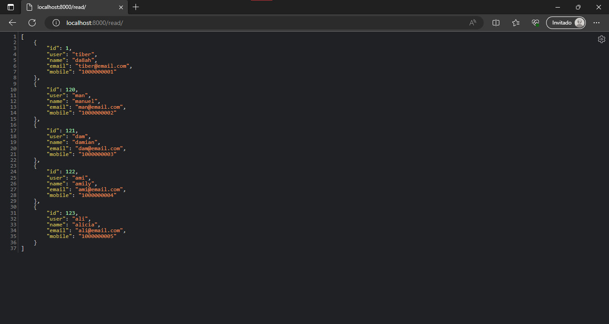
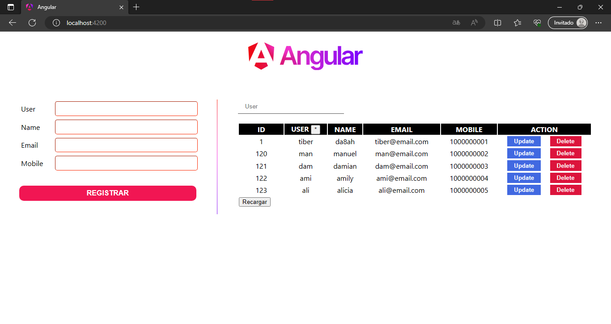

# django-angular-crud

<br/>
<br/>

## Django Backend: Docker setup (Ubuntu)

1. Install Docker.
2. Start the Docker service:

   ```bash
   sudo service docker start
   ```

3. Change to the `django/` directory:

   ```bash
   cd django/
   ```

4. Build the Docker image:

   ```bash
   sudo docker build -t da8ah/django-angular-crud .
   ```

5. Run the Docker image without Detach mode (-d) nor Volume (-v) for simplicity:

   ```bash
   sudo docker run -p 8000:8000 da8ah/django-angular-crud
   ```

   ```bash
   sudo docker run -d -v ~/programming/django-angular-crud/django/:/app -p 8000:8000 da8ah/django-angular-crud
   ```

6. Test if it's running; it should return an array from the database:

   [http://localhost:8000/read/](http://localhost:8000/read/)

<br/>
<div align="center">

</div>


### Build

```bash
sudo docker build -t <tag-name> <dockerfile-dir>
```

- **Tag (-t):** image alias
- **Dockerfile directory:** directory where the Dockerfile is

### Run

```bash
sudo docker run -d -v <project-dir>/:/app -p <host-port>:<container-port> <tag-name>
```

- **Detached mode (-d):** runs container in its own process so it doesn't close when the terminal is closed.
- **Volume (-v):** mount directory as a volume bind so changes made in the files of the given directory will update in the container.
- **Ports (-p):** the container port will be forwarded to the host port so you can use it in any browser like `http://localhost:<host-port>`.
- **Tag:** tag of the image that must run.

### Troubleshooting

These commands can be useful for manage images and containers.

- Stop and remove container processes:

  ```bash
  sudo docker stop <container-id>
  ```

  ```bash
  sudo docker rm <container-id>
  ```

- List all images and remove images:

  ```bash
  sudo docker images
  sudo docker image rm <image-id>
  ```


Use the container id returned by the run command to operate with the container.

- Open the container and Django server logs:

  ```bash
  sudo docker logs --follow <container-id>
  ```

- Access the container shell:

  ```bash
  sudo docker exec -it <container-id> sh
  ```

- Make Django migrations in the container shell if they are required:

  ```bash
  python3 manage.py migrate
  python3 manage.py makemigrations <app-name>
  ```

<br/>
<br/>

## Angular Frontend

1. Make sure Backend it's running.
   
2. Open the Angular project in another terminal:

   ```bash
   cd angular/
   ```

3. Install packages:

   ```bash
   npm i
   ```

4. Run the server:

   ```bash
   ng serve -o
   ```

5. If your browser ensures https usage you may use incognito mode with http only.

   [http://localhost:4200/](http://localhost:4200/)

<br/>
<div align="center">

</div>